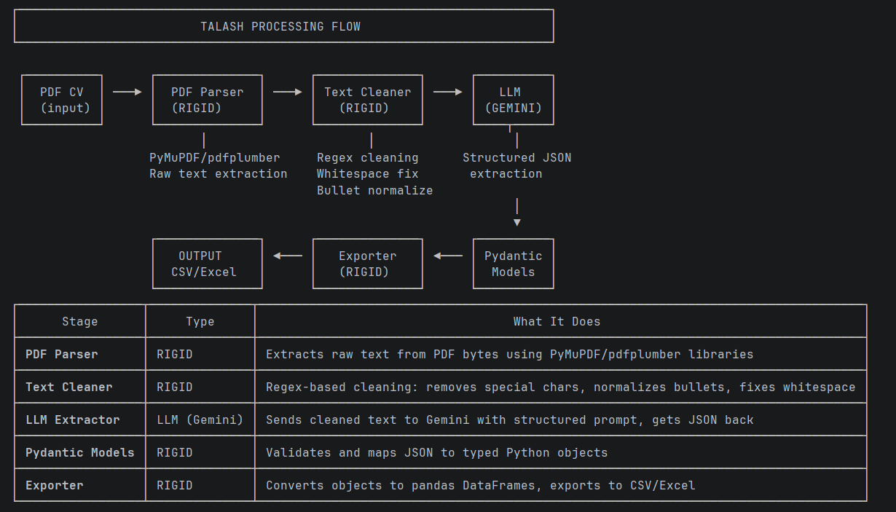

# TALASH - Smart HR Recruitment System

**Talent Acquisition & Learning Automation for Smart Hiring**

An AI-powered recruitment support system built using Large Language Models (LLMs) for CS 417 - Large Language Models course.

## Features

- PDF CV parsing and text extraction
- LLM-based structured information extraction using Google Gemini
- Relational database-like output format (CSV/Excel)
- REST API for programmatic access
- Batch processing of multiple CVs

## Project Structure

```
Talash/
├── src/
│   ├── api/              # FastAPI endpoints
│   ├── extraction/       # LLM extraction logic
│   ├── models/           # Pydantic data models
│   ├── preprocessing/    # PDF parsing & text cleaning
│   ├── utils/            # Config, export utilities
│   └── pipeline.py       # Main processing pipeline
├── data/
│   ├── input_cvs/        # Place CVs here for processing
│   └── output/           # Extracted data appears here
├── docs/
│   └── ARCHITECTURE.md   # System architecture
├── tests/                # Unit tests
├── requirements.txt      # Python dependencies
├── run.py               # Main entry point
├── .env.example         # Environment template
└── README.md
```

## Quick Start

### 1. Installation

```bash
# Clone the repository
cd Talash

# Create virtual environment
python -m venv venv

# Activate virtual environment
# On Windows:
venv\Scripts\activate
# On Linux/Mac:
source venv/bin/activate

# Install dependencies
pip install -r requirements.txt
```

### 2. Configuration

```bash
# Copy environment template
copy .env.example .env

# Edit .env and add your Gemini API key
# Get your key from: https://makersuite.google.com/app/apikey
```

### 3. Usage

#### Process a Single CV

```bash
python run.py single path/to/cv.pdf
```

#### Process Multiple CVs

```bash
# Place CVs in data/input_cvs/ folder
python run.py process -i data/input_cvs -f excel
```

#### Start API Server

```bash
python run.py api

# API will be available at http://localhost:8000
# Swagger docs at http://localhost:8000/docs
```

## API Endpoints

| Endpoint | Method | Description |
|----------|--------|-------------|
| `/` | GET | Health check |
| `/upload` | POST | Upload single CV |
| `/process/{file_id}` | POST | Process uploaded CV |
| `/process-folder` | POST | Process all CVs in folder |
| `/list-cvs` | GET | List input CVs |
| `/outputs` | GET | List output files |
| `/download/{filename}` | GET | Download output file |

## Output Format

The system generates relational tables with the following structure:

### Tables Generated

1. **candidates** - Personal information (primary table)
2. **education** - Educational records
3. **experience** - Work experience
4. **skills** - Technical and soft skills
5. **journal_publications** - Journal papers
6. **conference_publications** - Conference papers
7. **supervisions** - Student supervision records
8. **patents** - Patent records
9. **books** - Authored/co-authored books

All tables are linked via `candidate_id` foreign key.

## Technology Stack

- **Python 3.10+**
- **FastAPI** - REST API framework
- **Google Gemini** - LLM for extraction
- **PyMuPDF** - PDF processing
- **Pandas** - Data manipulation
- **Pydantic** - Data validation

## Milestone 1 Deliverables

- [x] Pre-Processing Module (PDF parsing, text extraction)
- [x] System Architecture Design
- [x] LLM/NLP Pipeline Design
- [x] Database/Storage Design
- [x] Early Prototype with basic upload/read flow
- [x] Folder-based CV ingestion

## Team

Affan Basra
Amna Akhtar Nawabi
Fatima Ehsan Niazi
(SEECS)
## License

Academic Project - NUST SEECS
